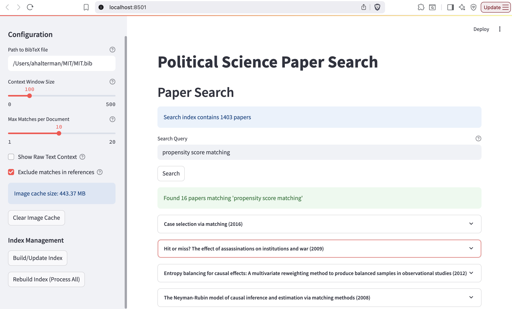
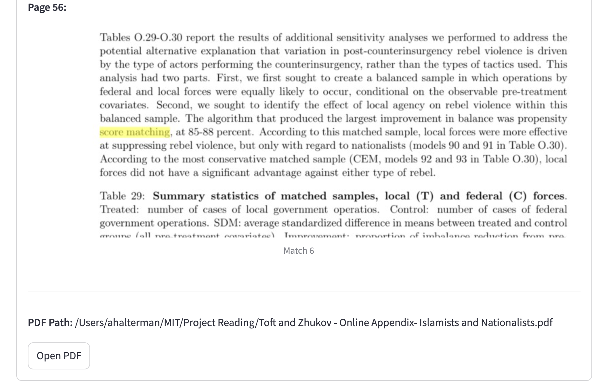

# Full text search of PDFs linked in BibDesk

[Bibdesk](https://bibdesk.sourceforge.io/) is a great open source citation management tool for manging .bib files on Macs. One of its features is the ability to link PDF documents to each entry in the bibliography. BibDesk has nice tools for tagging articles and doing searches of the citation information, but there's no easy way to do a full text search over all of the PDFs linked to your entries, especially if they're scattered over a bunch of folders.

This code will parse all the linked file paths, create a text index of your PDFs, and let you do keyword searches over all the PDFs. It'll return any articles with matches, show you where on the page the matches are, and let you open the PDF from the interface.

# Running

Install the requirements, then:

```
streamlit run paper_searcher.py
```

# Usage

In the main Streamlit interface, you can set the path to your .bib file, build the initial full-text cache, update the cache with any new entries in your .bib file, or change the size of the image preview. In the main area, you can enter your search term.



The results page shows the title of every article with a match, then (tries) to highlight where on the page the search term appears. Clicking the button at the bottom will open the original PDF.



# Warnings

The software is provided very much "as-is"–I've only tested it on my machine with my bibliography. It'll likely need modification to work with yours.

It's also specifically built for BibDesk, which has some ideosyncracies in how it stores the PDF file paths and is only available on Mac.
